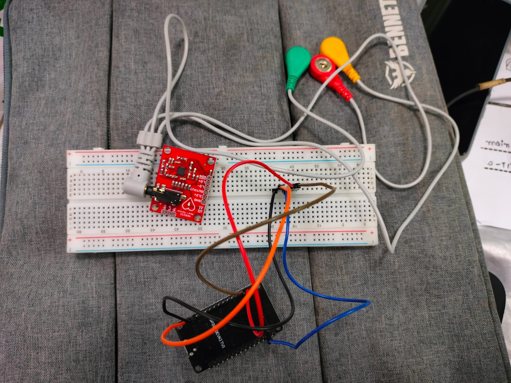
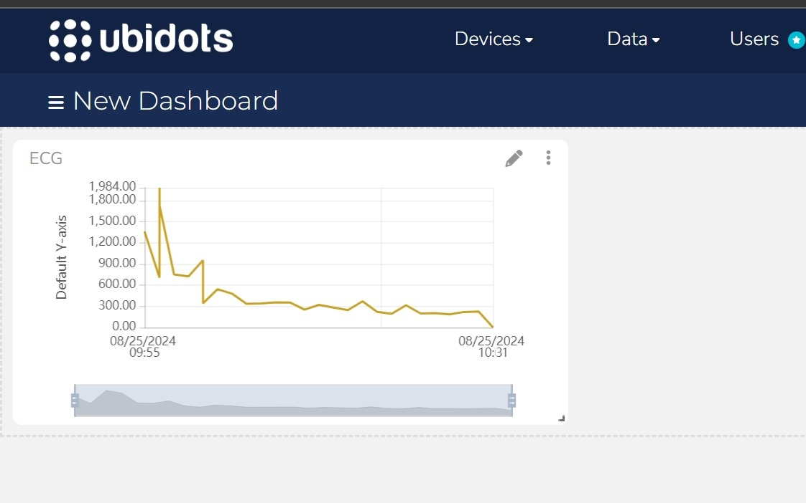

# Heart Insight

## Project Overview
This project focuses on building a low-cost device that can be used to regularly monitor your ECG (Electrocardiogram). We chose ECG as it is a non-invasive test that measures the electrical activity of the heart and helps diagnose a variety of heart conditions. The device aims to provide an affordable solution to monitor heart health, making it accessible to a larger population, especially in regions where healthcare services may be limited or expensive.

## Why ECG? What problems it solve?
ECG is a vital tool in diagnosing and screening for heart-related conditions. By capturing the electrical signals generated by the heart, an ECG can help identify:
- **Arrythmias**
- **Mayocardial Infraction**
- **Ischemia**
- **Damaged heart muscle**
- **Conduction Abnormalities**
- **Inflammation of the heart (myocarditis or pericarditis)**

With regular monitoring, these conditions can be detected early, allowing for timely intervention and better management of heart health.

## Features of Our Device
- **Low-Cost:** Designed to be affordable and accessible for all.
- **Non-Invasive:** The device uses non-invasive electrodes to capture the heart's electrical signals.
- **Portable:** Lightweight and easy to carry, enabling regular monitoring from the comfort of your home.
- **Real-Time Monitoring:** Provides real-time ECG data, which can be stored and analyzed by healthcare professionals.
- **User-Friendly:** Simple setup and operation, suitable for people with no medical background.

## Components
- **ECG Electrodes:** Non-invasive electrodes for capturing the heart’s electrical activity.
- **Microcontroller:** A small microcontroller to process the ECG signals.
- **Bluetooth/Wi-Fi Module:** For wireless data transmission to a mobile app or computer.
- **Web App:** An accompanying app that visualizes the ECG data and provides insights.

## How It Works
1. The ECG electrodes capture the electrical signals generated by your heart.
2. These signals are processed by the microcontroller(AD8232)and transmitted to your mobile device via Bluetooth/Wi-Fi(ESP32).
3. The Web app displays the ECG data in real-time and stores it for future reference.
4. The stored data can be shared with healthcare providers for further analysis.

## Benefits
- **Early Detection:** The device can help detect heart issues early, preventing severe complications.
- **Affordable Monitoring:** By lowering costs, we aim to make ECG monitoring accessible to everyone.
- **Regular Checkups:** Encourages regular self-monitoring of heart health without needing frequent doctor visits.

## Future Scope
- **Integration with Healthcare Systems:** Directly sending ECG data to hospitals or physicians for remote diagnosis.
- **AI-Powered Diagnosis:** Leveraging machine learning to provide real-time insights and flag abnormal patterns in ECG signals.
- **Cloud Storage:** Secure cloud storage for ECG data, accessible across devices and locations.

## Problems with our current device

The biggest challenge was to get quality data from our device ECG device. At it's current state it is built on a breadboard with ESP32 and AD8232 and is unsoldered giving way to many channel distortions leading to misleading or wrong data.

## Team
- Farhan Ali Mirza
- Mohammad Hatif Osmani
- Muhammad Tabish
- Azim Ahmed Warsi
- Muhammad Shariq

## Acknowledgements
We would like to thank StatusCode1 for the opportunity to work on this important project and our mentors and sponsors for their guidance and support.

